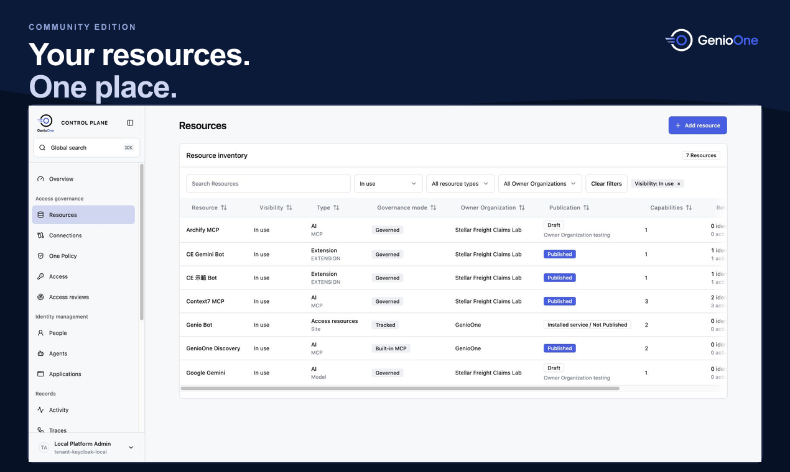

<p align="center">
  <picture>
    <source media="(prefers-color-scheme: dark)" srcset="packages/brand/assets/logos/genioone-horizontal-color-dark.svg">
    
  </picture>
</p>

<h3 align="center">Put AI agents to work with your team's tools.</h3>

<p align="center">
  Share tools and models. Let teammates use their own permissions. Trace each request.
</p>

<p align="center">
  <a href="https://genio.sh">Website</a> ·
  <a href="#quickstart">Quickstart</a> ·
  <a href="docs/public/ce/README.md">Documentation</a> ·
  <a href="https://www.producthunt.com/products/genioone?embed=true&amp;utm_source=embed&amp;utm_medium=post_embed">Product Hunt</a> ·
  <a href="README.zh-TW.md">繁體中文</a>
</p>

GenioOne helps teams connect AI agents to the tools and models they use at work. Publish shared resources, let teammates use them with their own permissions, and manage connections and request history in one place.

Community Edition is for developers and technical teams who can deploy services and connect resources they manage or have approval to use. Start with one project or a small team.



## Start with Genio Bot and one workflow

Start with the included Genio Bot and one workflow:

**Documentation → product brief.** Help the fictional Stellar Freight team plan a claims portal. Use Context7 to research framework documentation, then use the bundled Product Management skill to draft requirements and acceptance criteria.

Follow the [demo walkthrough](docs/public/ce/demo.md), or start with a [single MCP request](docs/public/ce/first-mcp-request.md). The walkthrough also covers [connecting Notion with OAuth](docs/public/ce/demo.md#optional-notion-oauth-and-bot-setup).

## Quickstart

You need macOS or Linux, Docker with Compose, Git, Node.js, pnpm **12.4.2**, and Bun **1.4.2**.

```sh
curl -fsSL https://genio.sh/install.sh | sh
```

This clones the repository, installs dependencies, and prepares `.env.local` files. It does not start services; run `pnpm dev` yourself. See `install.sh --help` for `--dir` and `--ref` options, or set up manually:

```sh
git clone https://github.com/dnplus/genio-one.git
cd genio-one
pnpm install --frozen-lockfile
cp apps/platform/.env.example apps/platform/.env.local
cp apps/bot/.env.example apps/bot/.env.local
pnpm dev
```

Open [Management](http://127.0.0.1:5173/management) and sign in with `admin` / `admin` for local development. Then follow [Gateway setup](docs/public/product/en/initial-setup.md#local-gateway-runtime) to connect your first Runtime.

Open [Genio Bot](http://127.0.0.1:5180/?lang=en) to start working with your tools. Configure your model account or provider credentials before starting a conversation.

See the [installation guide](docs/public/ce/quickstart.md) for prerequisites, service addresses, and restart instructions. These defaults are for local development; configure deployment credentials before exposing services.

## Share resources across your team

- **Publish shared tools and models.** Make resources available to the project or team that needs them.
- **Let teammates use their own permissions.** Grant access to specific tools and apply policy at the Gateway.
- **Reuse published resources across Bots.** Manage connection setup centrally; services that require personal accounts still use each user's authorization.
- **Trace requests.** Review identities, policy decisions, selected connections, and correlated activity.
- **Choose the client that fits.** Start with Genio Bot, or use another MCP client that supports the published endpoint's transport and authentication flow. See the [MCP request guide](docs/public/ce/first-mcp-request.md).

## Documentation and architecture

Community Edition includes the Platform management console and API, Gateway Runtime, and Genio Bot under Apache-2.0.

| Guide | Use it to |
| --- | --- |
| [CE overview](docs/public/ce/README.md) | Understand the included components and deployment boundaries |
| [Local installation](docs/public/ce/quickstart.md) | Start the stack and manage local services |
| [Initial setup](docs/public/product/en/initial-setup.md) | Configure identity, Resources, and a Gateway |
| [Kubernetes deployment](docs/public/ce/helm.md) | Build your images and deploy with Helm |
| [Troubleshooting](docs/public/ce/troubleshooting.md) | Diagnose startup and connection problems |
| [Known issues](docs/public/ce/known-issues.md) | Check current limitations and fixes |

## Feedback and contributions

Report bugs or suggest improvements in [GitHub Issues](https://github.com/dnplus/genio-one/issues). For a bug report, include reproduction steps and your environment; remove credentials and private data from logs.

For code changes, run `pnpm check`, `pnpm test`, and `pnpm build` before opening a pull request.

## License

[Apache License 2.0](LICENSE).
