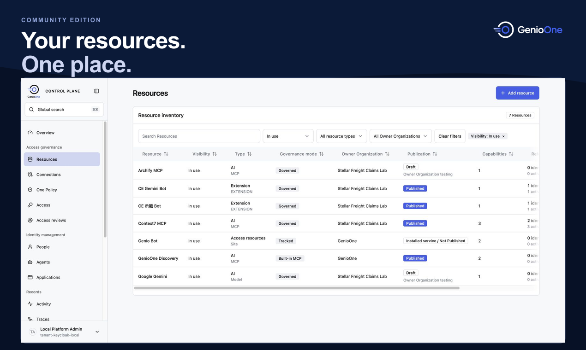

<p align="center">
  <picture>
    <source media="(prefers-color-scheme: dark)" srcset="packages/brand/assets/logos/genioone-horizontal-color-dark.svg">
    
  </picture>
</p>

<h3 align="center">The control plane for every AI agent and resource</h3>

<p align="center">讓 AI 代理使用需要的工具，管理存取權，追蹤每次操作。</p>

<p align="center">
  <a href="https://genio.sh">官方網站</a> ·
  <a href="#快速開始">快速開始</a> ·
  <a href="docs/public/ce/README.zh-TW.md">使用文件</a> ·
  <a href="https://www.producthunt.com/products/genioone?embed=true&amp;utm_source=embed&amp;utm_medium=post_embed">Product Hunt</a> ·
  <a href="README.md">English</a>
</p>

GenioOne 是可自行架設的 AI 代理、MCP 工具與模型存取管理平台。使用社群版，你可以發布工具、設定使用權限，在 Genio Bot 中執行工作，再從管理介面查看請求紀錄。



## 快速開始

準備 macOS 或 Linux、Docker 與 Compose、Git、Node.js、pnpm **10.32.1** 及 Bun **1.4.0**。

```sh
curl -fsSL https://genio.sh/install.sh | sh
```

這個指令會 clone repo、安裝依賴、準備 `.env.local`，但不會啟動服務，最後一步 `pnpm dev` 需要你自己執行。選項可用 `install.sh --help` 查看，或手動安裝：

```sh
git clone https://github.com/dnplus/genio-one.git
cd genio-one
pnpm install --frozen-lockfile
cp apps/platform/.env.example apps/platform/.env.local
cp apps/bot/.env.example apps/bot/.env.local
pnpm dev
```

開啟 [Management](http://127.0.0.1:5173/management)，使用本機開發帳號 `admin`／`admin` 登入，再依照[首次設定](docs/public/product/zh-TW/initial-setup.md)連接 Gateway Runtime。

開啟 [Genio Bot](http://127.0.0.1:5180/) 使用工具。開始對話前，請先設定模型帳號或供應者憑證。

完整前置條件、服務位址與重啟方式請看[安裝指南](docs/public/ce/quickstart.md)。上述預設值供本機開發使用，對外部署前請設定正式環境憑證。

## 你可以做什麼

- **連接 MCP 工具**：將服務發布到共用目錄，透過 OAuth 連接個人帳號。
- **使用 One Policy 控管存取**：授予指定工具的權限，並在 Gateway 執行政策。
- **在 Genio Bot 中工作**：為 Bot 加入工具與技能，進行文件研究及產品規劃。
- **查看每次請求**：追蹤操作身分、政策判定、使用的連線與對應活動。

社群版以 Apache-2.0 授權提供 Platform 管理介面與 API、Gateway Runtime，以及 Genio Bot。

## 試用一個工作流程

**文件研究 → 產品需求摘要。** 協助虛構的 Stellar Freight 團隊規劃貨運理賠入口，先用 Context7 查詢框架文件，再用內建 Product Management 技能整理需求與驗收條件。

依照[展示指南](docs/public/ce/demo.md)操作，或從[第一筆 MCP 請求](docs/public/ce/first-mcp-request.md)開始。指南也包含[以 OAuth 連接 Notion](docs/public/ce/demo.md#optional-notion-oauth-and-bot-setup) 的步驟。

## 使用文件

| 指南 | 內容 |
| --- | --- |
| [本機安裝](docs/public/ce/quickstart.md) | 啟動服務與管理本機環境 |
| [首次設定](docs/public/product/zh-TW/initial-setup.md) | 設定身分、資源與 Gateway |
| [Kubernetes 部署](docs/public/ce/helm.md) | 建置映像檔並使用 Helm 部署 |
| [疑難排解](docs/public/ce/troubleshooting.md) | 排查啟動及連線問題 |
| [已知問題](docs/public/ce/known-issues.md) | 查看目前限制與修復狀態 |

文件預設為英文，本頁與產品首次設定提供繁體中文版本。

## 回饋與貢獻

歡迎透過 [GitHub Issues](https://github.com/dnplus/genio-one/issues) 回報問題或提出建議。回報時請附上重現步驟與環境資訊，並移除紀錄中的憑證與私人資料。

提交程式碼前，請執行 `pnpm check`、`pnpm test` 與 `pnpm build`。

## 在 Product Hunt 上找到我們

<table>
  <tr>
    <td><a href="https://www.producthunt.com/products/genioone?embed=true&amp;utm_source=embed&amp;utm_medium=post_embed"></a></td>
    <td><strong>GenioOne</strong><br>The control plane for every AI agent and resource<br><a href="https://www.producthunt.com/products/genioone?embed=true&amp;utm_source=embed&amp;utm_medium=post_embed">Check it out on Product Hunt →</a></td>
  </tr>
</table>

## 授權

[Apache License 2.0](LICENSE)。
