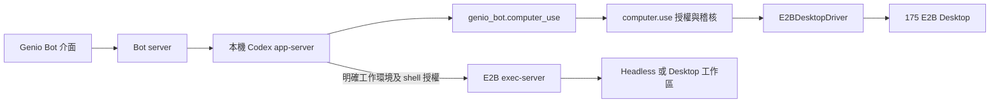

# Bot 預設工具交付

## 目標與範圍

讓登入的 Bot 擁有者從聊天指示 Bot 修改自己的角色與 Skills、建立另一隻私人 Bot、建立與管理排程，並透過既有 Bot 交接完成協作。需要桌面操作時，使用受 GenioOne 授權及稽核的 E2B Desktop adapter。

本次分支從 `b6d44108158e0b31d497cfb93f18fd768687aa89` 的遠端 main 開始。原工作樹的四筆既有提交保留於 `codex/bot-default-tools`，不納入本 PR。

## 使用者操作與可見結果

| 情境 | 入口與狀態轉換 | 完成證據 |
| --- | --- | --- |
| 修改自己 | 聊天要求 → 讀取目前版本 → 儲存設定 → 下輪載入 | 設定讀回一致、版本衝突可恢復、模型使用新版 |
| 自建 Skill | 聊天要求 → 儲存有版本的套件 → 載入 → 執行 | Bot 專屬 Skill 可讀回與回復，重啟後仍可載入 |
| 建立 Bot | 聊天要求 → owner-scoped 建立 → 卡片/清單出現 | 私人新 Bot 可開啟；重送不重複建立；無歷史或秘密複製 |
| 排程 | 一次性/每日/每週 → 啟用 → 到期排隊 → 執行與回報 | 關閉頁面可續跑；同時只一輪；重啟不重複作用；可暫停/刪除 |
| Bot 交接 | list_bots/send_to_bot 或 @Bot → 接受 → 執行 → 回覆 | 來源與目標 Bot、handoff、結果及 caller continuation 可對照 |
| 桌面操作 | 需要桌面 → policy → E2B lease → 截圖/操作 → 結果 | 真實畫面改變、模型收到截圖、拒絕不執行、correlation 與 policy revision |

## 責任與限制

- Bot 後端持有設定、Skills、排程及執行紀錄；SQLite 是目前單實例部署的持久來源。
- 設定與 Skills 只能修改目前 Bot；角色指示不授予資源、身分或執行權限。
- Skill 原始碼保留版本與受限相對路徑，安裝套件保持原版本。自有 Skills 以 Bot 專屬工具讀取，每輪附上目前版本的目錄；不加入程序共用的 native extraRoots。腳本僅能透過原有授權的執行工具使用。
- 排程每次執行重新檢查授權；目前需有記憶體中仍有效的擁有者登入，尚未提供長期離線憑證更新。憑證失效顯示需要登入；排程儲存不得持有明文 access/refresh token。錯過多次執行合併為一次，執行結果不確定時先對帳。
- 排程支援自有 Skills 與預設工具。已安裝 native Skill、plugin 或 MCP 的 Bot 會明確顯示需要從聊天執行，避免共用 app-server 的套件設定影響另一隻 Bot；背景套件隔離尚未納入本次實作。這個限制適用於新工作的啟動，已送出工作仍可唯讀查詢 native history，以核對不確定的結果。
- Bot 交接沿用現有 task/FYI 行為，不新增人類通知或臨時代理系統。
- Codex app-server 由 Bot server 在本機啟動，持有模型與 MCP 工具回合；E2B sandbox 內執行 Codex exec-server，承接遠端執行環境。`genio_bot.computer_use` 由 Bot server 授權，再經 `E2BDesktopDriver` 呼叫 Desktop SDK 操作 E2B 桌面。現階段不宣稱 Codex 原生 Computer Use remote driver 已接通。
- 一般桌面操作使用獨立 `computer.use` runtime capability；保留 `personal_bot.computer_use` gate。管理者須在 Bot 存取政策明確啟用電腦環境，既有政策缺少此設定時仍拒絕；執行時另檢查 runtime policy。每次動作均授權與回報，拒絕或失去 lease 時停止。
- 桌面瀏覽器使用綁定 runtime 與 desktop lease 的 60 秒握手憑證，交換為僅供該桌面路徑使用的 HttpOnly cookie；到期或 lease 變更後，新連線會被拒絕。已建立的 WebSocket 隨桌面 lease／上游連線結束，不會因握手憑證到期而每分鐘斷線，也不宣稱政策變更會立即切斷既有瀏覽器連線。模型每次桌面操作仍另行檢查政策。noVNC 密碼僅放在瀏覽器 URL fragment，代理不將它送入上游 HTTP query 或紀錄。頁面載入後只清除握手 query，保留 fragment，讓 noVNC 的非同步初始化仍能取得連線設定。
- 模型與 managed MCP 請求綁定執行中的 Bot，UI 選取另一隻 Bot 不會改變其授權、用途及稽核歸屬；模型橋接保留工具呼叫、結果與截圖內容。model/MCP/discovery relay 都驗證獨立的每 runtime 隨機憑證，再使用該 Bot 本次執行的授權向上游請求；重新連線與 OAuth 輪替不會改變該 runtime 的 relay 憑證。
- 同一擁有者的並行交接分別綁定 Bot／invocation 憑證；模型、MCP 與 Discovery 不讀取另一個交接的授權。預設工具使用綁定 runtime／Bot 的穩定入口：一般聊天沿用該 runtime 的最新登入憑證；委派期間優先使用該次委派的工具憑證，擁有者稍後登入不會擴大它的權限。委派結束後清除其綁定，回到同一 runtime 的前景授權；runtime 關閉後入口即失效，不借用另一個 runtime 的登入。這批生命週期修正通過 68 項聚焦測試、獨立審查與完整 Bot 檢查；真實閉頁排程與桌面路徑已通過下列驗收。
- 本機 Endpoint 的 GUI driver、多人同時操控桌面、Skills 市集發布不在本次範圍。

## Desktop 與原生工作環境的關係

桌面可用與原生工作環境的選取是兩件事，Headless 與 Desktop 可以是不同 lease。桌面工具沿用自己的授權路徑；前端明確要求檔案或 shell 工作才選取 Headless 原生執行環境。原生 Codex Computer Use remote driver 不在這張已實作路徑內。

隔離的 Codex 0.155.0 協定實測確認，`turn/start` 明確傳入空 `environments` 會清除先前記住的環境，省略則會保留；證據為 `native-empty-environment-semantics.json`。`thread/resume` 的清除行為未獲驗證，generated schema 也沒有此欄位，因此不作為清除保證。Bot server 在 resume 可接收工作環境選取意圖以執行授權、設定工具與 CWD，送入原生 resume 前移除該欄位；實際回合以 `turn/start` 明確指定環境。前端只在使用者要求 Headless 工作區後保留這項選取，切換 Bot 或重新連線時重設。

## 實作順序與分工

1. 自我設定、Bot 建立、持久 Skills 與版本 API/工具；整合模型與使用者可讀的狀態。
2. durable 排程、時區、佇列、執行恢復及既有交接閉環。
3. E2B Desktop driver、桌面工具與 canonical policy/audit。
4. 工具及 UI 整合、錯誤恢復、實際產品路徑驗證。
5. 範圍限定提交、推送、PR；處理 CI 與 review，保留最新 head 的驗證結果。

獨立模組由 Terra 實作；Luna 盤點及驗證；主代理整合、審查與維護 PR。共同環境與資料的變更維持單一執行流程。

## 合併就緒條件

- Bot 型別檢查、測試、build 與受影響的 Platform 檢查通過。
- owner/tenant 隔離、版本衝突、重送、恢復、暫停/撤權與桌面拒絕都有回歸測試。
- 真實 Bot 模型工具呼叫、保存讀回、排程回報及 Desktop 結果均有證據；未執行情境明確標示，不能以 fixture 代替。
- PR checks 通過、無衝突，必要 review 意見已修復或有明確處置。
- 只完成到可合併；實際 merge 不屬於本次要求。

## 驗證紀錄

進度由 `.walking-skeleton-default-tools.json` 追蹤。以下是 2026-09-21 的提交版驗證；各證據檔保留實際執行的前後端來源與已知限制。

| 層級 | 狀態 | 證據與限制 |
| --- | --- | --- |
| Bot 回歸 | PASS | 明確原生工作環境選取修正後完整檢查通過 494 tests／112 files／2,565 assertions；桌面與 Headless 的授權拒絕、空環境清除、續接工作區設定及 caller continuation 已納入回歸。先前 bootstrap 時序與委派授權聚焦測試亦通過。模型從初始化後的 native catalog 取得，明確覆寫舊 thread 的不適用模型 |
| Platform 授權／稽核／身分 | PASS | 新增明確電腦環境 gate 後，完整 `pnpm --filter genio-one check` 通過：加入桌面 permission preview 一致性修正後 927 項測試、18 skips、46 項介面測試，包含 schema、API client、architecture fingerprint、型別與 Compose 設定檢查；專用 Postgres policy roundtrip 3 tests 另通過 |
| 型別與建置 | PASS | Bot 與 Platform TypeScript；Bot Web bundle、Bun server bundle |
| 設定介面 | PASS | 本次工作樹完整 25 項 Playwright fixture 情境通過（單 worker，55.4 秒），包含保留 Headless 重新選取後等待 native 設定完成才派送，拒絕後保留原輸入並可繼續一般聊天，啟動期間第二次送出保留草稿且不覆蓋第一個工作，斷線恢復原草稿後可重新派送、包含 Skill 識別碼的唯讀提示不啟動 Headless，以及進度／拒絕通知經兩次對話更新後仍可見；包含 profile rebase、草稿切換／保留、關閉與刪除順序、儲存期間編輯保護。不等同真實模型驗收 |
| 真實管理介面／模型 | PASS | OIDC 專用測試 Bot 的 profile CAS、Skill 建立／修改／回復與重啟保存通過；模型已建立／更新 Skill、自我設定，並在下一回合讀回；模型建立私人 Bot 並以 list_bots 讀回相同 ID 也已通過；否定檔案操作的提示回歸通過。模型 send_to_bot、目標回覆與 caller continuation 已通過；最初的完成監聽缺口已修復；新服務已從原生歷史把舊 RUNNING 對帳為 COMPLETED，未重播或增加 attempts。第一個新閉頁測試在到期的 identity_verify 階段收到 Platform 401，正確保存 AUTH_REQUIRED 且未送 native turn，保留為失敗證據；後續有效登入短窗口的排程已在頁面關閉期間原生完成，SQLite 為 COMPLETED／attempts=1，重新開頁可讀回執行標記。Platform 真實瀏覽器確認電腦環境已發布狀態、修訂歷史及取消編輯後重新載入 |
| 175 E2B Desktop | PASS（有限制） | 模型經 computer_use 完成 XFCE 截圖、GUI 開啟 Mousepad、輸入標記及截圖讀回；noVNC 顯示與重新連線通過。invoke-only DENY 的實際 screenshot 呼叫在政策層拒絕，AUTHORIZE／REPORT correlation 一致。政策恢復原內容後，首次截圖與 noVNC 都是黑畫面，經授權工具送出小寫 shift 喚醒，revision 12 截圖確認原文字保留、拒絕標記不存在。原始 MCP PNG 已保存並獨立檢視。模型在已知拒絕後未發出 type，該變更動作拒絕的 Product 子案例明確標 NOT_RUN；另有後端回歸證明有效觀察／lease 也不能繞過 invoke 撤權 |
| PR checks／review | PASS（程式提交） | [PR #37](https://github.com/dnplus/genioone-private/pull/37) 無合併衝突。前十二輪 30 項意見均已修復、回覆及解決；第十三輪對 `b4f9f70c` [回覆沒有重大問題](https://github.com/dnplus/genioone-private/pull/37#issuecomment-5760719570)。該版本 [CI](https://github.com/dnplus/genioone-private/actions/runs/35601179176) 通過；後續 `4ddd441e` 僅補上撤權後輸入的測試，完整 494 項 Bot 測試與型別檢查通過，[CI](https://github.com/dnplus/genioone-private/actions/runs/35601568396) 已通過。程式驗證封存於 `4ddd441e`；證據與文件提交的最終 checks／ready 狀態以 PR 為準，不執行 merge |

真實管理介面驗收使用獨立 Bot server 5183、source UI 5184 與 SQLite，沿用已核對的本地 OIDC。測試 Bot 為 `bot-7afde906-f64`，Skill `uat-default-tools-skill-20260921` 已保存版本 1、2、3；profile CAS 恢復後為版本 3，直接工具更新後為版本 4，模型更新後為版本 5。模型已建立另一個專用 Skill 的版本 1／2，並在下一回合讀回新版 Skill 與 profile；證據保留於 `internal/evidence/bot/uat-default-tools-20260921/c1-model-write-readback.json`。模型另外透過 create_bot 建立 `bot-42841073-f47`，回傳 created=true，並以 list_bots 讀回同一 ID；證據為 `c1-model-create-readback.json`。模型 send_to_bot 交接已完成目標回覆及來源自動續接，證據為 `c1-model-handoff-readback.json`。新排程 `cdf5e2fa-2501-4683-b253-1945c1a1fe93` 在 08:56:39.077Z 關頁後、08:57:00Z 到期，run `bd9305ba-d77b-4045-92da-ce00b789ec68` 在重新開頁前已原生及持久化完成；08:58:17Z 讀回可見結果。證據為 `c2-schedule-closed-pass.json`，保留 native 工具呼叫 IDs；該輸出未提供 gateway correlation ID，因此不宣稱已取得這項關聯。這次成功使用仍有效的登入，未驗證長期離線憑證更新。

主線整合後使用獨立 Platform 58084 與 clone PostgreSQL，已通過健康及真實 OIDC actor 驗證。最新冷啟動套用 migration 002，`safety_decisions` 的 JSONB 預設值與約束正確；Bot 存取政策 revision 3、native MCP revision 3 與 desktop revision 1 均讀回一致，證據為 `internal/evidence/bot/uat-default-tools-20260921/platform-cold-restart-002.json`；載入 permission preview 修正 `d7a86e4b` 後再次冷啟動及 OIDC 讀回一致，保留於 `platform-cold-restart-003.json`。`computer.use` 已加入共用 capability registry；Codex 版本預設與 Docker 安裝均從 Bot package 的依賴版本取得，目前為 0.155.0。部署與驗收會重啟 Bot server，讓既有 thread 在新 app-server 程序載入 Bot 專屬路由。隔離的原生 Codex 0.155.0 實測確認初始 `thread/start.config` 會覆寫 CLI 的 MCP 與模型網址，只有指定端點收到請求；證據為 `native-initial-config-precedence.json`。同程序內既有對話的閒置更新未驗證，授權切換使用伺服器端綁定，不依賴這項行為。

Platform 電腦環境設定使用一次性的 5193 介面驗收：actor `person-platform-admin`、tenant `tenant-keycloak-local`、Bot 存取政策 revision 3。唯讀勾選與歷史內容正確；編輯關閉後取消並重新載入，仍保持已發布的啟用狀態。該次驗收未發布政策，5193 已停止。目前確認原有 5173 redirect 與 origin 存在、5193 已移除；清理曾以先前快照覆寫 redirect/origin 陣列，未依約僅移除本次新增值。Identity 未啟用管理事件紀錄，因此無法判定期間是否覆蓋其他操作者的並發修改，限制已保留於驗收證據。

C1 的 6154377d 重驗 R2 保留於 `c1-readback-intent-failure.json`：IAB 確認輸入與送出，但未觀察到原生 turn；正確紀錄為 FAIL／native UNKNOWN。原提示含有 Skill 識別碼 `model-write` 與 `profile`，會被舊英文詞界線誤判為寫檔。此窗口只有 shell exposure 與 Codex subscription ALLOW，沒有 shell execution DENY；不得將這次失敗歸因為 shell 執行政策拒絕。來源回歸亦確認本機進度／取消訊息會被後續對話 snapshot 清除，修正後明確保留至其生命週期移除。

最新 `fb0b6d4e` 冷啟動驗收：12:00:15.265Z 的 C1 R3 以相同唯讀提示成功回覆 profile revision 5、Skill revision 2 與指定標記；12:01:20.519Z 送出的交接收到子 Bot 真實回覆，來源續接顯示 `GENIO_FINAL_HANDOFF_CHILD_20260921_R1` 及 COMPLETED。新一次性排程 `515de08c-aa0d-41f6-a6de-d2015ad2a84c` 在 12:05:04.464Z 關頁後、12:06:06.146Z 到期，run `10fe1ba3-a56c-4094-8974-7185b5bccdb1` 已在重開前保存 COMPLETED／attempts=1；重開頁面可見 `GENIO_FINAL_C2_CLOSED_SCHEDULE_20260921_R1`。`c1-final-pass.json` 與 `c2-final-closed-pass.json` 已用原生 JSONL 與唯讀 SQLite 對帳，包含工具、目標回合及來源續接 IDs。原生完成時間為 12:06:38.975Z，SQLite 完成時間為 12:06:38.979Z；瀏覽器執行者確認重開前已查到完成狀態。精確重開時間未保存，12:12:01.300Z 僅代表可見標記讀回時間。未發出的 runtime session／Gateway correlation ID 保留為空，不以附近回合的 ID 代填。

桌面最終證據為 `c3-allow-deny-restore.json`、`c3-computer-invoke-deny-restore-audit.json` 與原生索引 `c3-native-evidence.json` 與截圖 `c3-allow-revision9.png`、`c3-restore-revision10.png`、`c3-restore-revision12.png`。實際畫面字串為 `GENIO_C3_VISIBLE_MARKER_20210921_R1`，保留原輸入的日期。invoke DENY correlation 為 `29485772-e345-4b17-abd8-3829812b9340`，policy revision 1 → 2（僅 invoke 拒絕）→ 3（恢復）之後內容 digest 與原值一致。後端執行來源為 fb0，與最新提交的產品後端相同；UI 在恢復窗口套用 autocomplete 修正，精確已載入版本未單獨記錄，不能宣稱整個桌面驗收只用單一 UI 提交。
