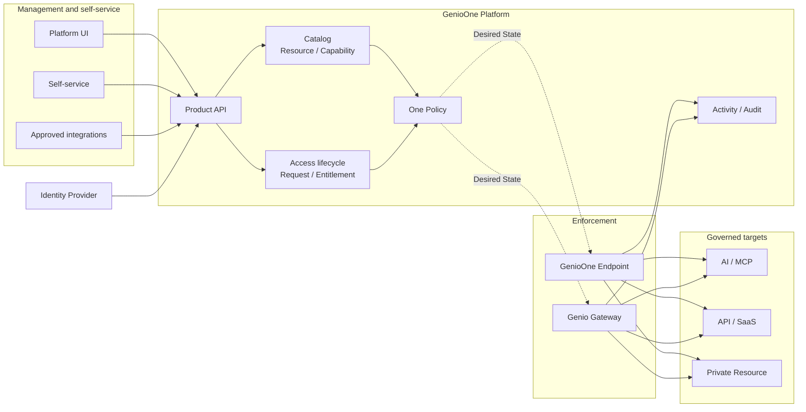
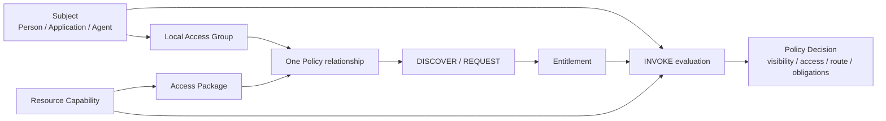

# GenioOne product concept

GenioOne is a governance and control plane for enterprise AI, MCP, APIs, SaaS, and private resources. It gives people, Applications, and third-party Agents one consistent way to discover, request, use, and review access without forcing every workload through a first-party chat Agent.

The product connects four questions that are usually split across identity, gateway, security, and audit tools:

1. **Who is acting?** A Person, Application, or Agent represented as a canonical Subject.
2. **What can they use?** A governed Resource and one or more separately controllable Capabilities.
3. **Why is access allowed?** A durable Entitlement created through One Policy and the access lifecycle.
4. **Where was the decision enforced?** A Genio Gateway, GenioOne Endpoint, or both, with Activity and Audit evidence.

## The problem GenioOne solves

Enterprise access becomes hard to reason about when identities live in one system, resource credentials in another, routing in gateways, and evidence in several logs. The result is often a choice between grants that are too broad and controls that are too fragmented to operate.

GenioOne turns that fragmented state into a shared model:

- imported identities become canonical Subjects instead of provider-specific records;
- Resources expose explicit Capabilities instead of one all-or-nothing permission;
- Local Access Groups and Access Packages keep policy authoring manageable at scale;
- Entitlements make effective access durable, attributable, and reviewable;
- One Policy evaluates discovery, requests, invocation, routing, and obligations;
- runtime components enforce desired state and return evidence to the control plane.

## Product architecture

The Product API is the deterministic control-plane boundary shared by the UI, approved integrations, and runtimes. Runtime traffic does not need to synchronously traverse the Product API: the control plane publishes desired state, enforcement points apply it, and runtime evidence flows back.

### Responsibilities and boundaries

| Component | Owns | Does not own |
| --- | --- | --- |
| Identity Provider | Authentication, federation, and directory identity | GenioOne authorization policy |
| GenioOne Platform | Tenant configuration, catalog, access lifecycle, policy versions, desired state, Activity, and Audit | Provider authentication or runtime packet forwarding |
| Genio Gateway | Runtime enforcement for AI/MCP, API Management, or Secure Access paths | Canonical policy authorship |
| GenioOne Endpoint | Local discovery, routing, enforcement, and runtime evidence | Tenant-wide policy authority |
| Provider or backend | The target service and its concrete upstream behavior | Canonical GenioOne grants |

## The authorization model

GenioOne keeps the low-level model precise, then adds reusable groupings so operators do not have to author every rule from loose identities and individual operations.

### Core objects

| Object | Meaning |
| --- | --- |
| **Subject** | The canonical acting identity: Person, Application, or Agent. |
| **Organization** | An administration and data boundary. It is not the policy membership group. |
| **Local Access Group** | A Tenant-owned set of Subjects used as a One Policy input. Membership alone grants nothing. |
| **Resource** | A governed object such as an AI service, MCP server, API, SaaS application, or private destination. |
| **Capability** | A separately governable operation on a Resource, such as read, invoke, write, or administer. |
| **Access Package** | A curated set of Resource Capabilities used to make policy authoring and requests understandable. It is not a grant by itself. |
| **Entitlement** | A durable grant with bounded Capabilities, conditions, provenance, validity, and lifecycle state. |
| **Connection** | A Resource-owned concrete upstream configuration. It is operational configuration, not the grant. |
| **One Policy** | The versioned relationship that evaluates who may discover, request, or invoke what, under which conditions. |

A One Policy decision can control:

- **visibility** — whether the Subject can discover the Resource or Access Package;
- **access** — whether the action is allowed, denied, or requires a request and approval;
- **route** — whether execution is `DIRECT`, `MANAGED`, or `BLOCK`;
- **obligations** — additional requirements such as approval, time bounds, device posture, or audit metadata.

## Deployment layers

GenioOne grows from a working control path rather than requiring every runtime component on day one.

| Layer | What becomes usable |
| --- | --- |
| **Tier 1 — Gateway** | Governed AI/MCP or API traffic, One Policy enforcement, Activity, and Audit through a Genio Gateway. |
| **Tier 2 — Endpoint** | Subject-aware local discovery, routing, enforcement, and evidence on managed devices. |
| **Optional Secure Access** | Forward-proxy or private-resource paths when explicitly configured. Installing an Endpoint does not enable Secure Access automatically. |

## End-to-end product journey

1. Connect an Identity Provider and establish Tenant administration and recovery.
2. Import or create Organizations, Subjects, and Local Access Groups.
3. Register Resources, their Capabilities, and operational Connections.
4. Curate Access Packages and author One Policy relationships.
5. Let Subjects discover and request access; approvals create durable Entitlements.
6. Evaluate invocation and route decisions at the relevant Endpoint or Gateway.
7. Use Activity, Audit, topology, and access analysis to understand who can access what and how that access was used.

## What GenioOne is not

- It is not an Identity Provider; authentication remains with the configured provider.
- It is not a prompt-based authorization system; policy decisions are deterministic and versioned.
- It is not only a VPN, proxy, or API gateway; those are enforcement paths within a larger governance model.
- It does not treat a provider credential or Connection as an Entitlement.
- GenioOne V1 governs third-party Agents, but does not require a first-party GenioOne Agent experience. That is a later product layer.

## Continue reading

| Goal | Guide |
| --- | --- |
| Bring a Tenant to its first governed request | [Initial setup](?view=product-docs&doc=initial-setup) |
| Study the authorization objects in detail | [Core concepts](?view=product-docs&doc=core-concepts) |
| Operate and investigate the platform | [Operations](?view=product-docs&doc=operations) |
