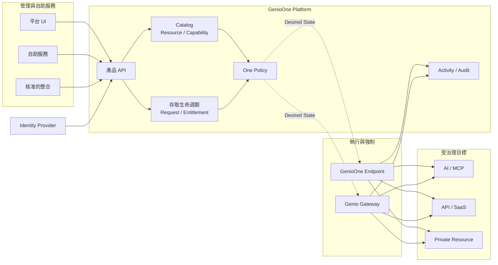
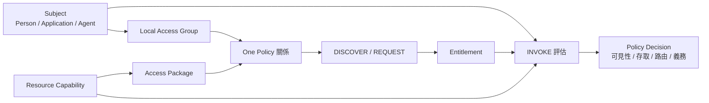

# GenioOne 產品概念

GenioOne 是企業 AI、MCP、API、SaaS 與私有資源的治理與控制平面。它讓人員、應用程式與第三方代理，以一致方式探索、申請、使用與複核存取權，而且不要求每個工作負載都先經過第一方聊天代理。

產品把原本分散在身分、Gateway、安全與稽核工具中的四個問題串在一起：

1. **誰正在操作？** 以 Person、Application 或 Agent 建立標準化 Subject。
2. **他能使用什麼？** 以受治理 Resource 與可獨立控制的 Capability 表達。
3. **為什麼允許存取？** 由 One Policy 與存取生命週期產生可追溯的 Entitlement。
4. **決策在哪裡執行？** 由 Genio Gateway、GenioOne Endpoint 或兩者共同強制，並產生活動與稽核證據。

## GenioOne 解決的問題

企業存取權通常分散在不同系統：身分在目錄服務、資源憑證在平台或 Provider、路由在 Gateway，證據又散落在多份日誌。最後往往只能在「授權過大」和「控制碎片化、難以維運」之間取捨。

GenioOne 把這些分散狀態整理成同一套模型：

- 將外部身分映射為標準化 Subject，而不是直接依賴 Provider 專屬記錄；
- 將 Resource 拆成明確 Capability，避免只能整個資源全開或全關；
- 以 Local Access Group 與 Access Package 降低大量規則的編寫成本；
- 以 Entitlement 保存有效存取權的來源、範圍、期限與狀態；
- 由 One Policy 統一評估探索、申請、呼叫、路由與附加義務；
- 由執行元件套用期望狀態，再把執行證據送回控制平面。

## 產品架構

產品 API 是 UI、核准整合與 Runtime 共用的確定性控制平面邊界。實際流量不必同步經過產品 API：控制平面發佈期望狀態，執行點套用決策，Runtime 再回傳活動與稽核證據。

### 責任與邊界

| 元件 | 負責 | 不負責 |
| --- | --- | --- |
| Identity Provider | 驗證、Federation 與目錄身分 | GenioOne 授權政策 |
| GenioOne Platform | Tenant 設定、Catalog、存取生命週期、政策版本、期望狀態、Activity 與 Audit | Provider 驗證或 Runtime 封包轉送 |
| Genio Gateway | AI/MCP、API Management 或 Secure Access 路徑的 Runtime 強制執行 | 標準政策的編寫與治理 |
| GenioOne Endpoint | 本機探索、路由、強制執行與 Runtime 證據 | 整個 Tenant 的政策權威 |
| Provider 或 Backend | 目標服務與具體上游行為 | GenioOne 的標準存取授權 |

## 授權模型

GenioOne 在底層保留精確模型，再用可重用的群組與套件包裝，避免操作人員每次都要從零散身分和單一操作開始編寫規則。

### 核心物件

| 物件 | 意義 |
| --- | --- |
| **Subject** | 標準化的操作身分：Person、Application 或 Agent。 |
| **Organization** | 管理與資料邊界，不是政策中的成員群組。 |
| **Local Access Group** | Tenant 自己管理、供 One Policy 使用的 Subject 集合；加入群組本身不會產生授權。 |
| **Resource** | 受治理物件，例如 AI 服務、MCP Server、API、SaaS 應用程式或私有目的地。 |
| **Capability** | Resource 上可分開治理的操作，例如讀取、呼叫、寫入或管理。 |
| **Access Package** | 為政策編寫與存取申請整理的 Resource Capability 套件；套件本身不是授權。 |
| **Entitlement** | 帶有 Capability 範圍、條件、來源、期限與生命週期狀態的持久授權。 |
| **Connection** | Resource 所屬的具體上游連線設定；它是操作設定，不是授權。 |
| **One Policy** | 決定誰能在什麼條件下探索、申請或呼叫哪些能力的版本化關係。 |

One Policy 決策可以同時控制：

- **可見性**：Subject 是否能探索 Resource 或 Access Package；
- **存取方式**：允許、拒絕，或必須先申請與核准；
- **路由**：執行時採用 `DIRECT`、`MANAGED` 或 `BLOCK`；
- **附加義務**：例如核准、時間限制、裝置姿態或稽核中繼資料。

## 部署層次

GenioOne 從最小可用控制路徑開始成長，不要求第一天就部署全部 Runtime 元件。

| 層次 | 可用能力 |
| --- | --- |
| **Tier 1 — Gateway** | 經由 Genio Gateway 治理 AI/MCP 或 API 流量，並提供 One Policy 強制、Activity 與 Audit。 |
| **Tier 2 — Endpoint** | 在受管理裝置上提供具 Subject 語意的本機探索、路由、強制與證據。 |
| **選用 Secure Access** | 明確設定後才提供 Forward Proxy 或私有資源路徑；安裝 Endpoint 不會自動開啟 Secure Access。 |

## 端到端產品流程

1. 串接 Identity Provider，建立 Tenant 管理與救援方式。
2. 匯入或建立 Organization、Subject 與 Local Access Group。
3. 註冊 Resource、Capability 與操作用 Connection。
4. 整理 Access Package，並建立 One Policy 關係。
5. 讓 Subject 探索與申請存取；核准後產生可追溯的 Entitlement。
6. 在適當 Endpoint 或 Gateway 評估呼叫與路由決策。
7. 透過 Activity、Audit、拓樸與存取分析，理解誰能存取什麼，以及實際如何使用。

## GenioOne 不是什麼

- 不是 Identity Provider；驗證仍由設定的 Provider 負責。
- 不是用 Prompt 猜測授權結果的系統；政策決策必須確定、可版本化。
- 不只是一套 VPN、Proxy 或 API Gateway；那些是完整治理模型中的執行路徑。
- 不會把 Provider 憑證或 Connection 當成 Entitlement。
- GenioOne V1 會治理第三方代理，但不要求第一方 GenioOne Agent 體驗；那是後續產品層。

## 接續閱讀

| 目標 | 文件 |
| --- | --- |
| 讓 Tenant 完成第一筆受治理請求 | [首次設定](?view=product-docs&doc=initial-setup) |
| 深入理解授權物件 | [核心概念](?view=product-docs&doc=core-concepts) |
| 維運與調查平台 | [維運指南](?view=product-docs&doc=operations) |
